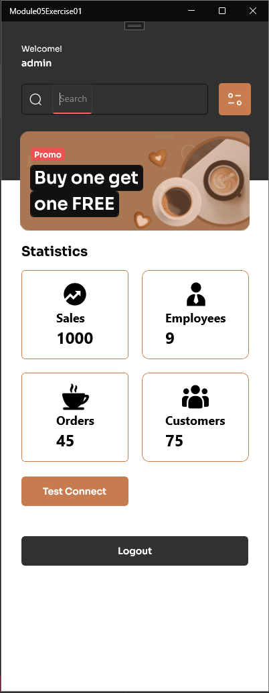
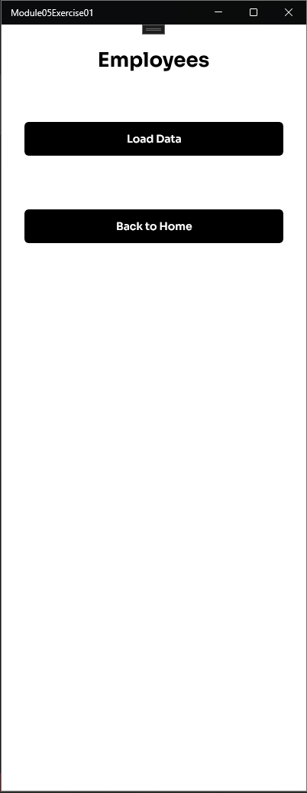
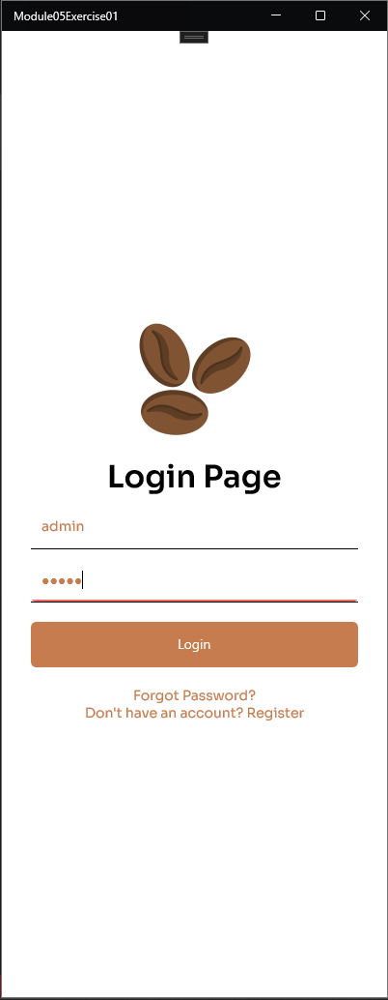
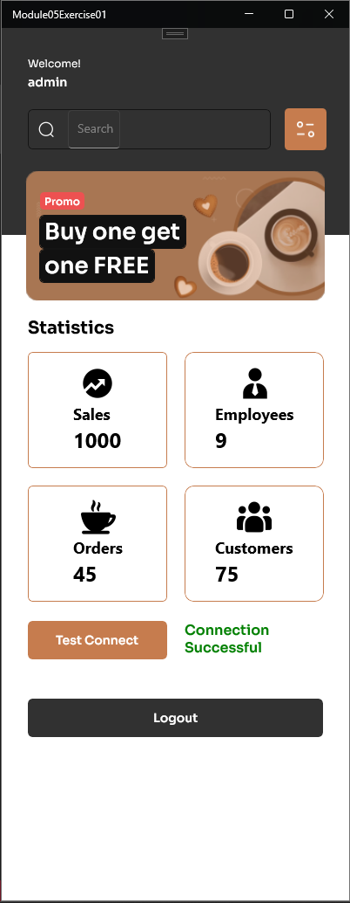
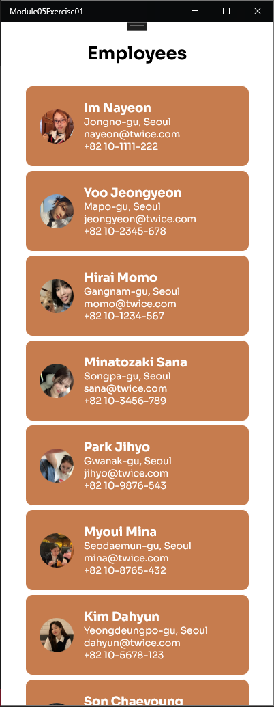
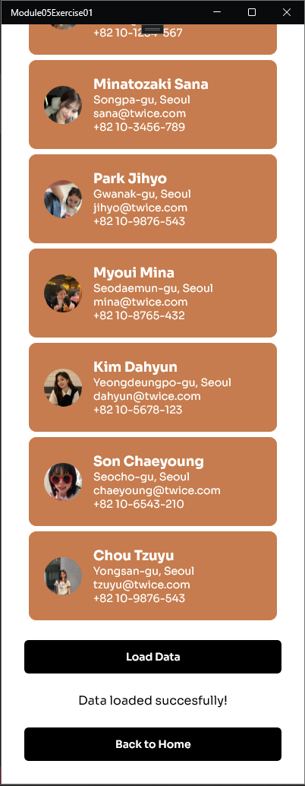
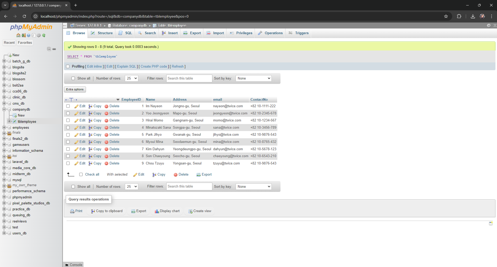

# Module05 - Exercise01 (PDC50-LAB)

    Name of Student: Elmalia Jane S. Diaz
    Year and Section: BSIT4A
    Activity Title: Module05-Exercise01
    Date Submitted: October 23, 2024

## Building a .NET MAUI Application for Contact Management Using MVVM and MySQL
### Source Code
- [MainPage.xaml](Module05Exercise01/MainPage.xaml)
- [MainPage.xaml.cs](Module05Exercise01/MainPage.xaml.cs)
- [Employee.cs](Module05Exercise01/Model/Employee.cs)
- [EmployeeViewModel.cs](Module05Exercise01/ViewModel/EmployeeViewModel.cs)
- [ViewEmployees.xaml](Module05Exercise01/View/ViewEmployees.xaml)
- [ViewEmployees.xaml.cs](Module05Exercise01/View/ViewEmployees.xaml.cs)
- [LoginPage.xaml](Module05Exercise01/View/LoginPage.xaml)
- [LoginPage.xaml.cs](Module05Exercise01/View/LoginPage.xaml.cs)
- [DatabaseConnectionService.cs](Module05Exercise01/Services/DatabaseConnectionService.cs)
- [EmployeeService.cs](Module05Exercise01/Services/EmployeeService.cs)

## Contact Management Application
### Output Screenshot

    
    
    

## Contact Management Application (Testing)
### Output Screenshot

    
    

    
    

## MySQL Database
### Output Screenshot

    

