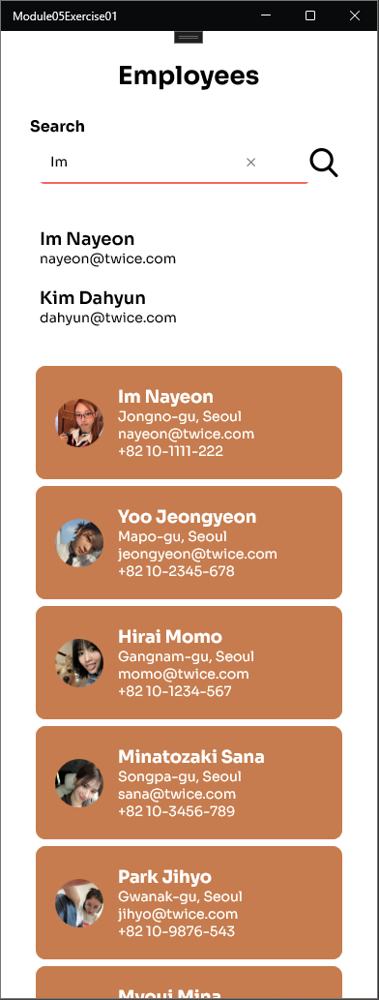
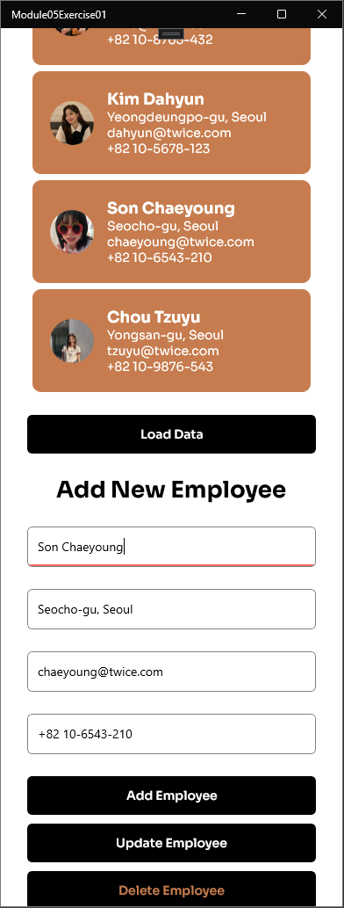

# Module05 - Exercise03 (PDC50-LAB)

    Name of Student: Elmalia Jane S. Diaz
    Year and Section: BSIT4A
    Activity Title: Module05-Exercise03
    Date Submitted: November 20, 2024

## Enhancing the Employee Contact Management Application
### Source Code
- [EmployeeService.cs](Module05Exercise01/Services/EmployeeService.cs)
- [EmployeeViewModel.cs](Module05Exercise01/ViewModel/EmployeeViewModel.cs)
- [ViewEmployees.xaml](Module05Exercise01/View/ViewEmployees.xaml)

## Search and Update
### Output Screenshots

    
    

## Searching an Employee
### Output Screenshots

    
    
    

    
    

## Updating an Employee
### Output Screenshots

    
    
    

    

    

